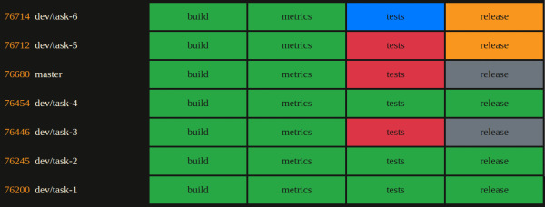

# web-pip-show

web-pip-show is a simple python webserver used to display gitlab CI/CD pipelines status.



Each line represent a pipeline, each case a stage.

| Color                                            | Description                      |
| ------------------------------------------------ | -------------------------------- |
|  | Created                          |
|    | Pending, Started, Build, Running |
|   | Success                          |
|    | Skipped, Cancelled               |
|     | Failed                           |


## Configure

Edit `config.json` file

```json
{
  "config": {
    "token": "<gitlab_token>",
    "url": "https://gitlab/",
    "id": "<id_project>",
    "size": "<size>",
    "port": "8003"
  }
}
```

| Parameters | Description                               |
| ---------- | ----------------------------------------- |
| token      | Gitlab token used to retrieve information |
| url        | Gitlab url                                |
| id         | Id of project                             |
| size       | Number of lines to display                |
| port       | Server port                               |

## Run

```shell
python server.py
```

Then visit [localhost:8003](http://localhost:8003/)